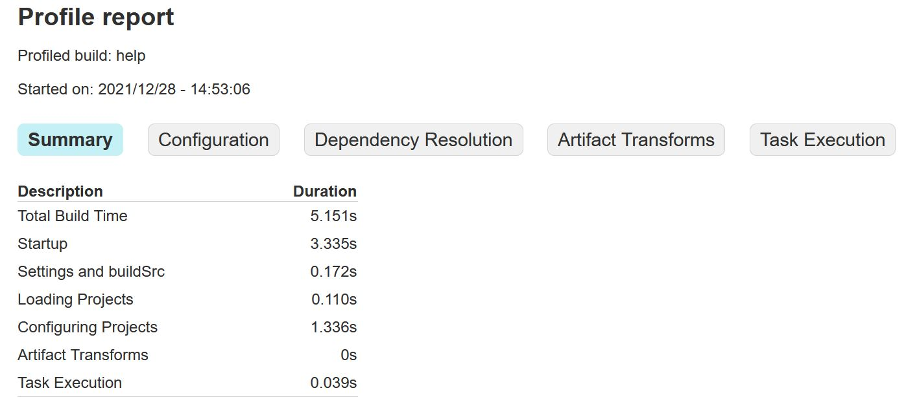
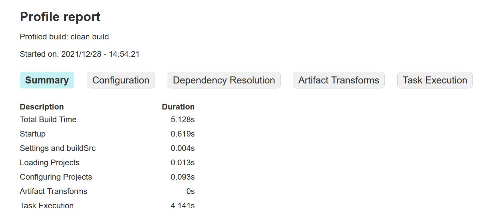

# Gradle commands

### Contribution Guidelines

1. Fork -> Clone the project.
2. Make change.
3. Raise pull request & merge.


## Executing Gradle on command line
Commands below assume that gradle is installed / available + accessible on target system.
Commands below can executed as is with gradle wrapper i.e. gradlew (unix) / gradlw.bat (windows) if gradle wrapper is installed for the project. Go to the root of the project / folder where build.gradle exist to execute commands.

Though commands below are tested on Gradle verison: 6.X, 7.X
these are expected to run on most of the gradle versions.
If a command is not longer in use / is changed, make change and raise pull request.


#### How to execute
Options are allowed before and after task names.
```text
gradle [taskName...] [--option-name...]
gradle clean build --profile  // e.g.
./gradlew clean build --profile  // gradle wrapper on unix
gradlew.bat clean build --profile  // gradle wrapper on windows
```

#### Gradle help

```text
gradle -h
gradle -help
```

#### Check gradle version

```text
gradle -v
gradle -version
```

<details>
  <summary>Sample output: </summary>

```text
------------------------------------------------------------
Gradle 7.3
------------------------------------------------------------

Build time:   2021-11-09 20:40:36 UTC
Revision:     96754b8c44399658178a768ac764d727c2addb37

Kotlin:       1.5.31
Groovy:       3.0.9
Ant:          Apache Ant(TM) version 1.10.11 compiled on July 10 2021
JVM:          11.0.8 (Azul Systems, Inc. 11.0.8+10-LTS)
OS:           Linux 5.10.60.1-microsoft-standard-WSL2 amd64
```
</details>

#### List all sub-projects in hierarichal format

```text
gradle projects
```

<details>
  <summary>Sample output: </summary>

```text
------------------------------------------------------------
Root project 'demo'
------------------------------------------------------------

Root project 'demo'
```
</details>

#### List main tasks for the project
This comand will give you list of main tasks. For list of all tasks check next command.
```text
gradle tasks
```

<details>
  <summary>Sample output: </summary>

```text
------------------------------------------------------------
Tasks runnable from root project 'demo'
------------------------------------------------------------

Application tasks
-----------------
bootRun - Runs this project as a Spring Boot application.

Build tasks
-----------
assemble - Assembles the outputs of this project.
bootBuildImage - Builds an OCI image of the application using the output of the bootJar task
bootJar - Assembles an executable jar archive containing the main classes and their dependencies.
bootJarMainClassName - Resolves the name of the application's main class for the bootJar task.
bootRunMainClassName - Resolves the name of the application's main class for the bootRun task.
build - Assembles and tests this project.
buildDependents - Assembles and tests this project and all projects that depend on it.
buildNeeded - Assembles and tests this project and all projects it depends on.
classes - Assembles main classes.
clean - Deletes the build directory.
jar - Assembles a jar archive containing the main classes.
testClasses - Assembles test classes.

Build Setup tasks
-----------------
init - Initializes a new Gradle build.
wrapper - Generates Gradle wrapper files.

Documentation tasks
-------------------
javadoc - Generates Javadoc API documentation for the main source code.

Help tasks
----------
buildEnvironment - Displays all buildscript dependencies declared in root project 'demo'.
dependencies - Displays all dependencies declared in root project 'demo'.
dependencyInsight - Displays the insight into a specific dependency in root project 'demo'.
dependencyManagement - Displays the dependency management declared in root project 'demo'.
help - Displays a help message.
javaToolchains - Displays the detected java toolchains.
outgoingVariants - Displays the outgoing variants of root project 'demo'.
projects - Displays the sub-projects of root project 'demo'.
properties - Displays the properties of root project 'demo'.
tasks - Displays the tasks runnable from root project 'demo'.

Verification tasks
------------------
check - Runs all checks.
test - Runs the test suite.
```
</details>

#### List all tasks for the project

```text
gradle tasks --all
```

<details>
  <summary>Sample output: </summary>

```text
------------------------------------------------------------
Tasks runnable from root project 'demo'
------------------------------------------------------------

Application tasks
-----------------
bootRun - Runs this project as a Spring Boot application.

Build tasks
-----------
assemble - Assembles the outputs of this project.
bootBuildImage - Builds an OCI image of the application using the output of the bootJar task
bootJar - Assembles an executable jar archive containing the main classes and their dependencies.
bootJarMainClassName - Resolves the name of the application's main class for the bootJar task.
bootRunMainClassName - Resolves the name of the application's main class for the bootRun task.
build - Assembles and tests this project.
buildDependents - Assembles and tests this project and all projects that depend on it.
buildNeeded - Assembles and tests this project and all projects it depends on.
classes - Assembles main classes.
clean - Deletes the build directory.
jar - Assembles a jar archive containing the main classes.
testClasses - Assembles test classes.

Build Setup tasks
-----------------
init - Initializes a new Gradle build.
wrapper - Generates Gradle wrapper files.

Documentation tasks
-------------------
javadoc - Generates Javadoc API documentation for the main source code.

Help tasks
----------
buildEnvironment - Displays all buildscript dependencies declared in root project 'demo'.
dependencies - Displays all dependencies declared in root project 'demo'.
dependencyInsight - Displays the insight into a specific dependency in root project 'demo'.
dependencyManagement - Displays the dependency management declared in root project 'demo'.
help - Displays a help message.
javaToolchains - Displays the detected java toolchains.
outgoingVariants - Displays the outgoing variants of root project 'demo'.
projects - Displays the sub-projects of root project 'demo'.
properties - Displays the properties of root project 'demo'.
tasks - Displays the tasks runnable from root project 'demo'.

Verification tasks
------------------
check - Runs all checks.
test - Runs the test suite.

Other tasks
-----------
compileJava - Compiles main Java source.
compileTestJava - Compiles test Java source.
components - Displays the components produced by root project 'demo'. [deprecated]
dependentComponents - Displays the dependent components of components in root project 'demo'. [deprecated]
model - Displays the configuration model of root project 'demo'. [deprecated]
prepareKotlinBuildScriptModel
processResources - Processes main resources.
processTestResources - Processes test resources.
```
</details>

#### Sample task command
```text
gradle clean build  // In a multi build project, if this command is executed on root folder it will run tasks for all sub projects
gradle <subproject>:<taskName>  // Run task for a given sub project. If executed from sub project only gradle <taskName> is required.
```
<details>
    <summary>Sample output: </summary>

```text
Starting a Gradle Daemon (subsequent builds will be faster)

BUILD SUCCESSFUL in 36s
8 actionable tasks: 8 executed
```

</details>

#### Forcing a task to execute
By default gradle does not rerun a task if already executed and gradle could not detect any changes in source / dependency / clean command is used. To force gradle to rerun command use following.
```text
gradle test --rerun-tasks
```

#### Skipping a task

Use -x before a task to skip it.

```text
gradle clean build -x test
```

<details>
    <summary>Sample output: </summary>

```text
Starting a Gradle Daemon (subsequent builds will be faster)

BUILD SUCCESSFUL in 20s
6 actionable tasks: 6 executed
```

</details>

#### List task dependencies in Gradle
A gradle task e.g. build could have dependencies e.g. assemble, check, test etc. 
How to get task dependencies in Gradle.
Check [here](https://stackoverflow.com/questions/10422054/is-there-a-way-to-list-task-dependencies-in-gradle).

<details>
    <summary>Sample output: </summary>

```text
Starting a Gradle Daemon (subsequent builds will be faster)

BUILD SUCCESSFUL in 20s
6 actionable tasks: 6 executed
```

</details>

#### How to display list of tasks without actually executing the Gradle command
```text
gradle [tasks...]  [--options...] --dry-run
gradle build --dry-run
```

<details>
    <summary>Sample output: </summary>

```text
:compileJava SKIPPED
:processResources SKIPPED
:classes SKIPPED
:bootJarMainClassName SKIPPED
:bootJar SKIPPED
:jar SKIPPED
:assemble SKIPPED
:compileTestJava SKIPPED
:processTestResources SKIPPED
:testClasses SKIPPED
:test SKIPPED
:check SKIPPED
:build SKIPPED
```

</details>

#### How to add gradle to an existing java project

Go to root directory.
```text
gradle init
```
All necessary gradle files / folder e.g. build.gradle, settings.gradle, gradlew , gradle folder etc. will be created.
<details>
    <summary>Sample output: </summary>

```text
Select type of project to generate:
  1: basic
  2: application
  3: library
  4: Gradle plugin
Enter selection (default: basic) [1..4]


Select build script DSL:
  1: Groovy
  2: Kotlin
Enter selection (default: Groovy) [1..2]

Project name (default: myproject):

> Task :init

BUILD SUCCESSFUL in 40s
2 actionable tasks: 2 executed
```

</details>

#### How to add gradle wrapper (/ upgrade version of gradle wrapper) to a gradle project

Go to root directory of project.
If the gradle wrapper is already installed, command below will change the gradle wrapper version to the version specified in command.
```text
gradle wrapper --gradle-version <gradle_version>
gradle wrapper --gradle-version 7.3.2  // e.g.
```

<details>
    <summary>Files added to project: </summary>

```text
└── <project folder>
    └── gradlew
    └── gradlew.bat
    └── build.gradle
    └── 
    └── 
    └── gradle
        └── wrapper
            └── gradle-wrapper.jar
            └── gradle-wrapper.properties
```

</details>

#### Gradle dependency graph

Go to project root folder having build.gradle file. Use following command.
```text
gradle dependencies
gradle dependencies  >  dependencies.txt // redirect output to file (overrides the file)
gradle dependencies  >>  dependencies.txt // redirect output to file (append to file)
gradle dependencies  | less // view with less
gradle dependencies  | grep -i <dependencyname> // grep for specific dependency
```
If using gradle wrapper use
```text
./gradlew dependencies  // for unix
```
Above command also shows configurations in project e.g. compieClasspath is configuration in output below.
<details>
  <summary>Sample output: </summary>

```text
> Task :dependencies

------------------------------------------------------------
Root project 'demo'
------------------------------------------------------------

annotationProcessor - Annotation processors and their dependencies for source set 'main'.
\--- org.projectlombok:lombok -> 1.18.22

apiElements - API elements for main. (n)
No dependencies

archives - Configuration for archive artifacts. (n)
No dependencies

bootArchives - Configuration for Spring Boot archive artifacts. (n)
No dependencies

compileClasspath - Compile classpath for source set 'main'.
+--- org.projectlombok:lombok -> 1.18.22
+--- org.springframework.boot:spring-boot-starter-web -> 2.6.2
|    +--- org.springframework.boot:spring-boot-starter:2.6.2
|    |    +--- org.springframework.boot:spring-boot:2.6.2
|    |    |    +--- org.springframework:spring-core:5.3.14
|    |    |    |    \--- org.springframework:spring-jcl:5.3.14
|    |    |    \--- org.springframework:spring-context:5.3.14
|    |    |         +--- org.springframework:spring-aop:5.3.14
|    |    |         |    +--- org.springframework:spring-beans:5.3.14
|    |    |         |    |    \--- org.springframework:spring-core:5.3.14 (*)
|    |    |         |    \--- org.springframework:spring-core:5.3.14 (*)
|    |    |         +--- org.springframework:spring-beans:5.3.14 (*)
|    |    |         +--- org.springframework:spring-core:5.3.14 (*)
|    |    |         \--- org.springframework:spring-expression:5.3.14
|    |    |              \--- org.springframework:spring-core:5.3.14 (*)
|    |    +--- org.springframework.boot:spring-boot-autoconfigure:2.6.2
|    |    |    \--- org.springframework.boot:spring-boot:2.6.2 (*)
|    |    +--- org.springframework.boot:spring-boot-starter-logging:2.6.2
|    |    |    +--- ch.qos.logback:logback-classic:1.2.9
|    |    |    |    +--- ch.qos.logback:logback-core:1.2.9
|    |    |    |    \--- org.slf4j:slf4j-api:1.7.32
|    |    |    +--- org.apache.logging.log4j:log4j-to-slf4j:2.17.0
|    |    |    |    +--- org.slf4j:slf4j-api:1.7.25 -> 1.7.32
|    |    |    |    \--- org.apache.logging.log4j:log4j-api:2.17.0
|    |    |    \--- org.slf4j:jul-to-slf4j:1.7.32
|    |    |         \--- org.slf4j:slf4j-api:1.7.32
|    |    +--- jakarta.annotation:jakarta.annotation-api:1.3.5
|    |    +--- org.springframework:spring-core:5.3.14 (*)
|    |    \--- org.yaml:snakeyaml:1.29
|    +--- org.springframework.boot:spring-boot-starter-json:2.6.2
|    |    +--- org.springframework.boot:spring-boot-starter:2.6.2 (*)
```
</details>

#### Gradle dependency insight

Insight of a particular dependency or dependencies
```text
gradle dependencyInsight --dependency <specific dependency>  --configuration // If configuration is not specified by default compileClasspath configuration will be used
gradle dependencyInsight --dependency org.springframework:spring-core:5.3.14
gradle dependencyInsight --dependency org.springframework:spring-core:5.3.14 --configuration 
```

<details>
  <summary>Sample output: </summary>

```text
org.springframework:spring-core:5.3.14 (selected by rule)
   variant "apiElements" [
      org.gradle.category                 = library
      org.gradle.dependency.bundling      = external
      org.gradle.jvm.version              = 8 (compatible with: 17)
      org.gradle.libraryelements          = jar (compatible with: classes)
      org.gradle.usage                    = java-api
      org.jetbrains.kotlin.localToProject = public (not requested)
      org.jetbrains.kotlin.platform.type  = jvm (not requested)
      org.gradle.status                   = release (not requested)

      Requested attributes not found in the selected variant:
         org.gradle.jvm.environment          = standard-jvm
   ]

org.springframework:spring-core:5.3.14
+--- org.springframework:spring-aop:5.3.14
|    +--- org.springframework.security:spring-security-config:5.6.1
|    |    \--- compileClasspath
|    +--- org.springframework.security:spring-security-web:5.6.1
|    |    \--- compileClasspath
|    +--- org.springframework.security:spring-security-core:5.6.1
|    |    +--- compileClasspath
|    |    +--- org.springframework.security:spring-security-config:5.6.1 (*)
|    |    \--- org.springframework.security:spring-security-web:5.6.1 (*)
|    +--- org.springframework:spring-webmvc:5.3.14
|    |    +--- org.springframework.boot:spring-boot-starter-web:2.6.2
|    |    |    +--- compileClasspath (requested org.springframework.boot:spring-boot-starter-web)
|    |    |    \--- org.springframework.boot:spring-boot-starter-websocket:2.6.2
|    |    |         \--- compileClasspath (requested org.springframework.boot:spring-boot-starter-websocket)
|    |    \--- org.springdoc:springdoc-openapi-webmvc-core:1.6.3
|    |         \--- org.springdoc:springdoc-openapi-ui:1.6.3
|    |              \--- compileClasspath
|    \--- org.springframework:spring-context:5.3.14
|         +--- org.springframework.security:spring-security-config:5.6.1 (*)
|         +--- org.springframework.security:spring-security-web:5.6.1 (*)
|         +--- org.springframework.security:spring-security-core:5.6.1 (*)
|         +--- org.springframework.kafka:spring-kafka:2.8.1
|         |    \--- compileClasspath (requested org.springframework.kafka:spring-kafka)
|         +--- org.springframework:spring-webmvc:5.3.14 (*)
|         +--- org.springframework:spring-websocket:5.3.14
|         |    \--- org.springframework.boot:spring-boot-starter-websocket:2.6.2 (*)
|         \--- org.springframework.boot:spring-boot:2.6.2
|              +--- org.springframework.boot:spring-boot-starter:2.6.2
|              |    +--- org.springframework.boot:spring-boot-starter-web:2.6.2 (*)
|              |    \--- org.springframework.boot:spring-boot-starter-json:2.6.2
|              |         \--- org.springframework.boot:spring-boot-starter-web:2.6.2 (*)
|              \--- org.springframework.boot:spring-boot-autoconfigure:2.6.2
|                   +--- org.springframework.boot:spring-boot-starter:2.6.2 (*)
|                   \--- org.springdoc:springdoc-openapi-common:1.6.3
|                        \--- org.springdoc:springdoc-openapi-webmvc-core:1.6.3 (*)
+--- org.springframework:spring-beans:5.3.14
|    +--- org.springframework.security:spring-security-config:5.6.1 (*)
|    +--- org.springframework.security:spring-security-web:5.6.1 (*)
|    +--- org.springframework.security:spring-security-core:5.6.1 (*)
|    +--- org.springframework:spring-webmvc:5.3.14 (*)
|    +--- org.springframework:spring-web:5.3.14
|    |    +--- org.springframework.boot:spring-boot-starter-web:2.6.2 (*)
|    |    +--- org.springframework.security:spring-security-web:5.6.1 (*)
|    |    +--- org.springframework.boot:spring-boot-starter-json:2.6.2 (*)
|    |    +--- org.springframework:spring-webmvc:5.3.14 (*)
|    |    +--- org.springframework:spring-websocket:5.3.14 (*)
|    |    \--- org.springdoc:springdoc-openapi-common:1.6.3 (*)
|    +--- org.springframework:spring-messaging:5.3.14
|    |    +--- org.springframework.boot:spring-boot-starter-websocket:2.6.2 (*)
|    |    \--- org.springframework.kafka:spring-kafka:2.8.1 (*)
|    +--- org.springframework:spring-context:5.3.14 (*)
|    +--- org.springframework:spring-aop:5.3.14 (*)
|    \--- org.springframework:spring-tx:5.3.14
|         \--- org.springframework.kafka:spring-kafka:2.8.1 (*)
+--- org.springframework:spring-context:5.3.14 (*)
+--- org.springframework:spring-expression:5.3.14
|    +--- org.springframework.security:spring-security-web:5.6.1 (*)
|    +--- org.springframework.security:spring-security-core:5.6.1 (*)
|    +--- org.springframework:spring-webmvc:5.3.14 (*)
|    \--- org.springframework:spring-context:5.3.14 (*)
+--- org.springframework:spring-messaging:5.3.14 (*)
+--- org.springframework:spring-tx:5.3.14 (*)
+--- org.springframework:spring-web:5.3.14 (*)
+--- org.springframework:spring-webmvc:5.3.14 (*)
+--- org.springframework:spring-websocket:5.3.14 (*)
+--- org.springframework.boot:spring-boot:2.6.2 (*)
+--- org.springframework.boot:spring-boot-starter:2.6.2 (*)
+--- org.springframework.security:spring-security-config:5.6.1 (*)
+--- org.springframework.security:spring-security-core:5.6.1 (*)
\--- org.springframework.security:spring-security-web:5.6.1 (*)

(*) - dependencies omitted (listed previously)
```
</details>

#### Status of gradle daemons

```text
gradle --status
```

<details>
  <summary>Sample output: </summary>

```text
PID STATUS   INFO
287 IDLE     7.3
```
</details>

#### Stop gradle daemon

Stops a gradle daemon if running
```text
gradle --stop
```

<details>
  <summary>Sample output: </summary>

```text
Stopping Daemon(s)
1 Daemon stopped
```
</details>

#### High level gradle tasks performance report
 Profile build execution time and generates a report in the build_dir/reports/profile directory
```text
gradle --profile
gradle <list of tasks> --profile  // gradle clean build --profile
```

<details>
  <summary>Sample output: Profile </summary>

  

</details>

<details>
  <summary>Sample output: Profile Clean Build</summary>

  

</details>


#### Gradle user home
 Specify gradle user home directory. Defaults to ~/.gradle
```text
gradle --gradle-user-home
```


#### Gradle offline mode
 Gradle will not use network
```text
gradle --offline
```

#### Build projects in parallel

```text
gradle --parallel
```

#### Continue task execution after a task failure

```text
gradle --continue
```

#### Do not use Gradle daemon

```text
gradle --no-daemon
```
